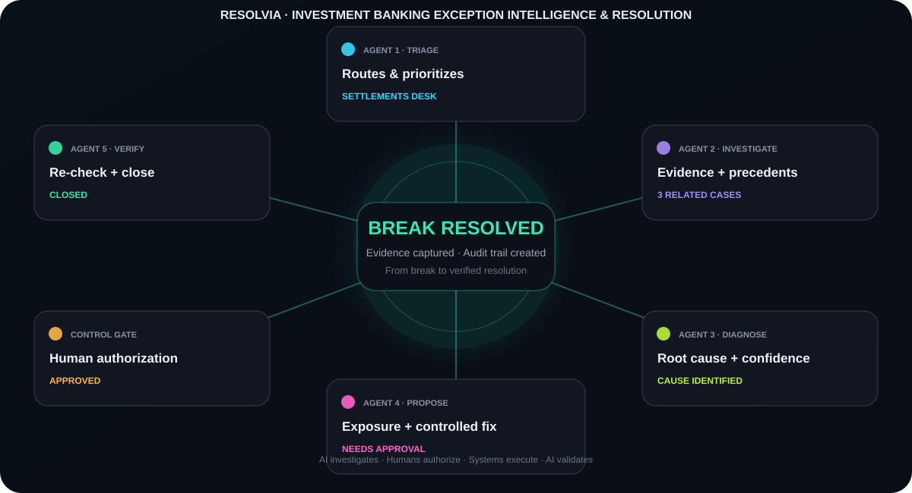

# RESOLVIA

<p align="center">
  <strong>Investment Banking Exception Intelligence &amp; Resolution</strong><br/>
  <em>From Break to Verified Resolution.</em>
</p>

<p align="center">
  <a href="https://resolvia.streamlit.app/"></a>
  <a href="https://github.com/hiralsarkar/Resolvia"></a>
</p>

<p align="center">
  
  
  
  
  
  
  
  
  
</p>

<p align="center">
  
</p>

## The idea

Post-trade reconciliation breaks are rarely difficult because the final fix is complicated. They are difficult because an analyst has to **find the evidence, connect the records, determine the root cause, assess the exposure, obtain authorization, execute the controlled fix, and verify the outcome**.

**Resolvia turns that workflow into a coordinated exception-resolution system.**

> **AI investigates. Humans authorize. Systems execute. AI validates.**

It covers cash-equity exceptions across **trade, settlement, position, cash and corporate-action** workflows using a synthetic but format-realistic dataset.

### [▶ Open the live application →](https://resolvia.streamlit.app/)

---

## How a break moves through Resolvia

```
TRIAGE
   ↓
INVESTIGATION
   ↓
ROOT CAUSE
   ↓
RESOLUTION PROPOSAL
   ↓
CONTROL GATE  ← Human authorization
   ↓
VALIDATION
   ↓
VERIFIED RESOLUTION
```

The **Orchestrator coordinates the stages; it does not make the decision itself.**

| Stage | What happens |
|---|---|
| 🔵 **Triage** | Routes the exception to a break family and assigns severity. |
| 🟣 **Investigation** | Retrieves trade records, settlement messages, contract notes, OCR evidence and similar precedent cases. |
| 🟢 **Root Cause** | Classifies the underlying cause across 20 root-cause classes and provides confidence with alternatives. |
| 🩷 **Resolution Proposal** | Determines the recommended remediation and quantifies exposure. |
| 🟠 **Control Gate** | Enforces policy. Review, approval or escalation remains a human decision. |
| 🟢 **Validation** | Re-checks the records after the controlled action and closes or reopens the case. |

---

## What makes it an exception-intelligence system?

### Evidence before explanation
Investigation retrieves the relevant records and precedent cases before the system proposes a resolution.

### Model + rules + retrieval
Resolvia combines machine-learning classification, deterministic policy logic, document/OCR extraction and semantic retrieval rather than relying on a single model.

### Human-in-the-loop by design
The **Control Gate is policy code, not a model**. Exceptions requiring authorization stop until an operator chooses **Review, Approve or Escalate**.

### Resolution is not the finish line
A proposed fix is not treated as success. Resolvia performs a separate validation step to verify whether the underlying break actually cleared.

---

## Technical stack

| Layer | Technologies |
|---|---|
| **Application** | Python · Streamlit |
| **Machine Learning** | Scikit-learn · XGBoost · PyTorch |
| **NLP / Retrieval** | Sentence Transformers · NumPy-based embedding indices |
| **Document Intelligence** | EasyOCR · SWIFT / contract-note extraction |
| **Analytics** | Pandas · Plotly · Matplotlib |
| **LLM Layer** | OpenRouter · configurable model fallback |
| **Workflow** | Python Orchestrator · deterministic Control Gate |
| **Data / Evaluation** | Synthetic trade-break generator · model evaluation pipeline |

The LLM layer is optional. The core investigation, classification, policy and validation workflow can operate without an API key.

---

## Results

| Metric | Result |
|---|---:|
| Trades / breaks | **6,000 / 3,000** |
| Root-cause classifier — test macro-F1 | **0.933** |
| Rules-only baseline — macro-F1 | **0.820** |
| Break-family classifier | **1.000** |
| OCR accuracy on scanned confirms | **~99%** |
| Precedent cases | **400** |
| Precedent outcomes | **380 closed · 20 reopened** |

See [`docs/model_comparison.md`](docs/model_comparison.md) for the detailed model comparison and [`docs/eda_notebook.ipynb`](docs/eda_notebook.ipynb) for the exploratory analysis.

---

## Application flow

1. **Home** — visualizes the six stations working through a case.
2. **Choose an exception** — select a break from the exception universe.
3. **Watch the analysis** — observe the live investigation pipeline.
4. **Make the decision** — review the evidence and authorize, escalate or reject the proposed action.
5. **Overall results** — inspect portfolio-level outcomes and model performance.

---

## Run locally

Python **3.10+** is recommended.

```bash
cd backend
python -m venv .venv
.venv/Scripts/activate        # source .venv/bin/activate on macOS/Linux
pip install -r requirements.txt

cd ..
streamlit run frontend/app.py
```

The first analysis can take around 20 seconds while models and retrieval indices load. Subsequent cases are faster.

For the optional narrative layer, copy `.env.example` to `.env` and set `OPENROUTER_API_KEY`. `OPENROUTER_MODEL` can be configured as a comma-separated fallback list.

---

## Rebuilding the data and models

Generators run from `data/`; model and retrieval builds run from `backend/`.

```bash
cd data
python generate_trade_breaks.py
python generate_broker_confirms.py
python render_scanned_images.py
python validate_dataset.py

cd ../backend
python embeddings/build_indices.py
python models/family_classifier/train.py
python models/ml_classifier/train.py
python knowledge/build_resolved_cases.py
python eval/baseline_comparison.py
```

---

## Repository structure

```
data/       Synthetic data generation, taxonomy, validation, EDA
backend/    Agents, orchestrator, control gate, models, OCR, retrieval, evaluation
frontend/   Streamlit application, theme, views and interaction layer
docs/       Proposal, project pitch, EDA, model comparison and workflow visual
```

---

## Known limits

- Application state is held in memory, so cases reset when the server restarts.
- The repair step is simulated; no real settlement or trading system is modified.
- The dataset is synthetic and designed for realistic workflow demonstration.
- Production deployment would require persistent state, enterprise data controls, authentication, audit infrastructure and integration with real post-trade systems.

---

<p align="center">
  <strong>RESOLVIA</strong><br/>
  <sub>Investment Banking Exception Intelligence &amp; Resolution</sub>
</p>
